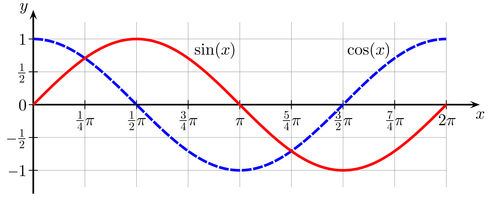

# Rotating an object:
***
This is my note on rotating objects.

This is a fundamental concept of math:
sin, cos and complex numbers are used for rotating a body.
To visualize this concept, I used the SDL_2 library with C.
I believe that C is the best language for understanding but it is not that practical.


## Using sine and cosine.
Firstly, have a look at the code:
```c
const int angleIncrement = 10, centerX = WINDOW_WIDTH / 2, centerY = WINDOW_HEIGHT / 2;

double angle = angleIncrement * Pie / 180; // Convert angle to radians

for(int i = 0; i < totalPointOfX_Y; i++){
    double originalX = x[i] - centerX;
    double originalY = y[i] - centerY;
    x[i] = centerX + originalX * cos(angle) - originalY * sin(angle);
    y[i] = centerY + originalX * sin(angle) + originalY * cos(angle);
}
```

Prerequirements:
- X & Y of all vertex of the said object must be known else another method can be used.

So what the hell is that?

Understanding the Code:
- Constants:
    - angleIncrement is the angle change per frame.
        If Angle was 10, next frame it will be 20 and next 30 and so on...

    - centerX && centerY is the point from which the rotation takes place.

- angle:
    computer uses the unit of radian for calculation so a simple conversion:
    Formulae:
        $$\text{angleInDegree} = \frac{\text{angleInRadian} \times \pi}{180}$$
        $$\text{angleInRadian} = \frac{\text{angleInDegree} \times 180}{\pi}$$

- The Loop:
    Basically the loop is acting on all of the vertex and applying the same formulae based on the common center of rotation:

    $$x' = x \cos(\theta) - y \sin(\theta)$$
    $$y' = x \sin(\theta) + y \cos(\theta)$$

    > Derivation of formulae is on another section. [Click Here](../Other/sinCosForRotationDerivation.html#derivation).

    Highly recomended to look at the derivation to better your concept as a programmer.

    In short, the rotation happens upon a center X, Y which in my case is the center of the screen. (The value can be changed to change the center)
    Sin and Cos have a unique graph to them from their primary definition. Y is defined by sine of the angle while cos is defined by the x-coodinate.

    

    What happens if the graph is limited to single point while

    Again, look at the derivation to better understand the formulae.


## Using Complex Numbers:
On Development...
